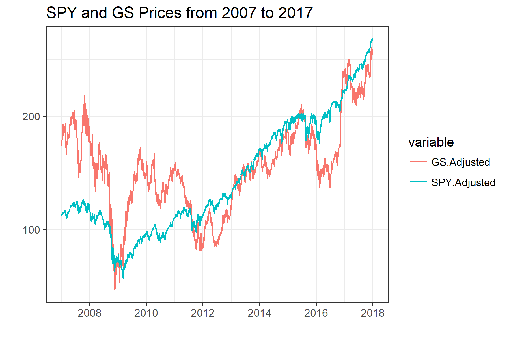

```{r, echo = FALSE}
knitr::opts_chunk$set(echo = TRUE, warning = FALSE, message = FALSE, cache = TRUE)

```

<meta property="og:title" content="Basic Time-Series Analysis, the Game">
<meta property="og:description" content="Even for students who are well trained in econometrics-statistics, getting started with time-series analysis can be mystifying.">
<meta property=”og:type” content=”article”>


When graduate students approach me hoping to start research in price analysis, they usually have to start from ground zero in terms of their time-series statistical training. Even incoming graduate students well trained in econometrics often have seen little, if any, treatment of time-series techniques because first and even second econometrics courses focus most of their time on cross-sectional and panel techniques.

For the graduate student aspiring to do a (Ph.D.) dissertation or (M.S.) thesis in price analysis this is a real bummer because it often will be 6 to 18 months before they can work a formal time-series course into their schedule, severely delaying their research unless they can learn a lot on their own. 

This series of posts is for my current and future new-ish graduate students who will soon start research in applied price analysis or finance, but feel overwhelmed and under-prepared in the ways of time-series econometrics (this is totally normal, by the way). I hope it will also be accessible to anyone who has had a basic class in statistics (through linear regression), and an interest in price analysis or forecasting. 

When you start a time-series class or read a paper that uses time-series analysis for the first time you are greeted by a barrage of new statistical tests and terms like, "Augmented Dickey-Fuller (ADF) Test", "Johansen's Cointegration Test", "AR(p)", "GARCH(p,q)", "Vector Autoregression (VAR)" and "Vector Error Correction Model (VECM)" to name a few. 

Since a statistics or econometrics class has to cover so much... well, statistics, sometimes the forest can be lost for the trees in how all these tests and models can help one build a case around the research question they care about. 

I'm not going to get too deep into the details of these issues; for that I link to resources for how you can start to learn more on your own at the bottom. Rather, in this series I give a 30,000 ft view of 'The Game' that is going on in applied time-series analysis. It follows a fairly standard template. 

# The Game

Most introductory time-series efforts are utilized toward one of the following three goals: 

+ Stationary and Non-Stationary Data and Issues

+ Determining if Variables "Move Together" or are Otherwise Correlated

+ Adjusting for Residuals that may not be Perfect "White Noise"

Each of these can be thought of as a model selection exercise, helping you to pick which statistical model is the right choice for your research question. After a while you will have an intuition about which model to use on which kind of data; even then you have to go through this process in every research project to convince your reader that you did, in fact, choose a suitable model for the question at hand. 

If you are new to this you probably don't have any intuition about what the right model is for your question, but going through these three issues will lead you there anyway. 

In the rest of this post we will cover 'Stationary and Non-Stationary Data and Issues'. Later posts will cover the second and third bullets. 

## Stationary and Non-Stationary Data and Issues

The first thing you have to establish in any time-series analysis is whether your data are stationary or not because it essentially determines whether you should try to model levels of the data or first differences of the data. 

If you want to see the R code that generates any of the following stuff, visit [my Github repostory](https://github.com/mindymallory/BlogPosts/blob/master/2018-01-02-Time-Series-Explainer.Rmd) that has the source code for this blog post.  

**Stationary Data**

In the figure below I simulate and plot a stationary series. The series comes from 500 draws of a normal distribution with mean = 300 and standard deviation = 0.25. Notice that it is basically flat, with random ups and downs. 

That is basically what stationarity means, all the data come from a single probability distribution. 

```{r}

# If you are following along, uncomment the next lines and run once to install the required packages 
# install.packages('ggplot2')
# install.packages('xts')
# install.packages("stargazer")
# install.packages('quantmod')
# install.packages('sde')
# install.packages('broom')
# install.packages('tseries')
# install.packages("kableExtra")
# install.packages("knitr")


# These lines 'load' the required packages, something you have to do every time you start an R session, even if the package is installed on your machine.  
library(ggplot2)
library(xts)

# Making the fake price series
## Dates
end     <- Sys.Date()
start   <- end - 499 
t       <- as.Date(start:end)

## 500 fake prices from a normal distribution
x       <- rnorm(n = 500, mean = 300, sd = .25)

## Put dates and prices together in a time-series object
p       <- as.xts(x, order.by = t)

# Plot It
autoplot(p, ts.colour = "dark blue") + 
  labs(title = "Fake Stationary Price Series Centered around P = $300", x = "", y = "Price") + 
  theme_bw() + 
  scale_x_date(date_labels = "%m-%d-%Y", date_breaks = "3 month")

```

When you look at this plot it is not hard to imagine that it came from draws from a single probability distribution, namely:

$$p_t \sim N(\mu = 300, \sigma = .25)$$

We need our data to be stationary in order to be able to do statistical tests and modelling on it. So if the data is not stationary, we have to transform it so it is and do our analysis on the transformed variable. The next sub-section should explain why. 

**Non-Stationary or Unit Root Data**

Below I plot SPY, the exchange traded fund that tracks the S&P 500 Index, from 1990 to 2017. By visual inspection you should have a sense that this series is non-stationary in that the prices appear to be trending. 

```{r}
library(quantmod)
getSymbols(c('SPY', 'GS'))
```

```{r}
# In Yahoo Finance data, the Adjusted column accounts for any stock splits that may have taken place.
autoplot(SPY$SPY.Adjusted) + 
  theme_bw() + 
  geom_line(color = "dark blue") + 
  labs(title = "SPY Prices from 2007 to 2017", x = "")
```


So for example, if you wanted to write down the probability distribution that generate the prices, you would have to know where you are in time. Since the probability distribution that generated the prices keeps changing over time, the distribution is not stationary. This fact will mess up our statistical analysis. 

$$p_t \sim N(\mu_t, \sigma_t)$$

*Spurious Regression*

One of the worst things non-stationary data does is set you up to believe that you have found a really strong relationship between two variables, when you really have just found a 'spurious relationship'. In the figure below I plot SPY and Goldman Sachs (GS) prices from 2007 to 2017.  

<!-- ```{r} -->
<!-- #Not sure why this chunk can run in console, but won't knit. Oh well, saved to .png and embedded that way. -->
<!-- data <- cbind(SPY$SPY.Adjusted, GS$GS.Adjusted) -->
<!-- q <- autoplot(data, facets = FALSE) + -->
<!--   theme_bw() + -->
<!--   labs(title = "SPY and GS Prices from 2007 to 2017", x = "") -->
<!-- ggsave('images/nonstationary.png', width = 6, height = 4) -->
<!-- ``` -->



To illustrate a 'spurious regression' let's regress GS prices on lagged SPY prices. That means we are going to try to use yesterday's prices of SPY to try to predict today's GS prices.

$$GS_t = \beta_0 + \beta_1SPY_{t-1}  + \epsilon_t$$
The results of the regression are printed below. We find that lagged SPY prices are highly statistically significant predictors of GS prices. If you take these results to the stock market and think you can predict GS prices you will probably be very poor very soon. 

The problem is that the 'statistical significance' comes from the fact that we just ran a super-consistent regression. That basically means that since the variables we used in the regression are (probably, we didn't prove it here) non-stationary pretty much any regression we run will conclude statistical significance in a typical t-test. In other words, the regression results below aren't valid because the statistic doesn't follow the t distribution in the first place, but when you go along as it it does follow the t distribution, you will get 'significant' results almost every time. 
```{r, results = "asis"}
library(stargazer)
GS <- GS$GS.Adjusted
SPY <- SPY$SPY.Adjusted
linMod <- lm(GS ~  lag(SPY))
stargazer(linMod, type  = "html", title = "GS Prices Regressed on Lagged GS and Lagged SPY Prices", align = TRUE)
```

You may be skeptical at this point. I mean, after all, it isn't that crazy to think that today's GS prices would be related to yesterday's SPY prices. So to illustrate, now we'll simulate two series so we are sure they are not related. Then we will regress one on the lag of the other and show statistical significance. 

The simulated prices are plotted below.

```{r, echo = TRUE}
# The function, GBM() from the sde package simulates a geometric brownian motion. Which is the same a assuming prices follow a lognormal ditribution, and is the standard baseline model for prices. 
library(sde)
fakeSPY   <- GBM(x = 275, r = 0.15, sigma = .2, T = 1, N=650)
fakeGS    <- GBM(x = 243, r = 0.10, sigma = .3, T = 1, N=650)

```

```{r}
library(broom)
dates     <- seq(as.Date("2018-01-01"), length = 651, by = "days")
fakeSPY   <- xts(x=fakeSPY, order.by = dates)
fakeGS    <- xts(x=fakeGS, order.by = dates)

data      <- cbind(fakeSPY, fakeGS)
colnames(data) <- c('fakeSPY', 'fakeGS')
data      <- tidy(data)

ggplot(data, aes(x = index, y = value, color = series)) + 
  geom_line() + 
  theme_bw() +
  labs(title = "Simulated SPY and Simulated GS Prices from 2007 to 2017", x = "")

```

Now lets run the same regression as we did with the real prices. The regression results are shown in the table. 

$$fakeGS_t = \beta_0 + \beta_1fakeSPY_{t-1}  + \epsilon_t$$

```{r, results = "asis"}
linMod <- lm(fakeGS ~  lag(fakeSPY) )
stargazer(linMod, type  = "html", title = "Simulated GS Prices Regressed on Lagged Simulated SPY Prices")
```

Huh, still crazy significant. It's not a real relationship, but appears to be significant because we didn't have any business doing a t-test here in the first place. We know the regression is meaningless because we simulated these prices to be independent ourselves. That is the problem with non-stationary data in a nutshell, if you regress non-stationary variables on one another, you will always get spurious 'significant' results. 

So what to do? The answer is almost always this: if your data are non-stationary, convert the series into percentage changes by creating variables of logged price differences. In the context of the examples we have been using, that would be

$$SPYReturn_t = log(SPY_t) - log(SPY_{t-1}).  $$
Plotted, the price returns look like the following. 
```{r}
SPYRet    <- log(SPY) - log(lag(SPY))
GSRet     <- log(GS) - log(lag(GS))
data      <- cbind(SPYRet, GSRet)

colnames(data) <- c('SPY', 'GS')
data      <- tidy(data)

ggplot(data, aes(x = index, y = value, color = series)) + 
  geom_line() + 
  theme_bw() +
  labs(title = "SPY Returns and GS Returns from 2007 to 2017", x = "")

```

Clearly, this is not exactly white noise. We have clear periods of heightened volatility (we'll cover what to do about that in another post). But, at least the series are not trending up or down. We have solved the problem of non-stationarity by using price percent returns instead of price levels. Just to drive this point home, let's regress GS returns on lagged SPY returns and show they are no longer significant. 

```{r, results = "asis"}
linMod <- lm(GSRet ~  lag(SPYRet) )
stargazer(linMod, type  = "html", title = "GS Returns Regressed on Lagged SPY Returns")
```

The statistical significance is gone! Bummer! But really this is good. It is a sign that the returns we generated are in fact stationary. 

# Stationarity Testing

We went through all the discussion above basically assuming that we knew whether or not the data were stationary or not. In real applied research, you always have to make a case whether or not the data are stationary to support your choice to use levels or returns in your analysis. 

There are several stationarity tests, also often called Unit Root tests. I'll list the main ones here. 

+ Augmented Dickey-Fuller Test
    + Null Hypothesis is Unit Root
    + Reject Null Hypothesis $\Rightarrow$ Series is stationary $\Rightarrow$ Use price levels
    + Fail to Reject $\Rightarrow$ Series has a unit root $\Rightarrow$ Use price returns
    + Said and Dickey (1984)
    
+ Phillips-Perron (PP) Test
    + Null Hypothesis is Unit Root
    + Reject Null Hypothesis $\Rightarrow$ Series is stationary $\Rightarrow$ Use price levels
    + Fail to Reject $\Rightarrow$ Series has a unit root $\Rightarrow$ Use price returns
    + Perron (1988)
    
+ KPSS-Test
    + Null Hypothesis is Stationarity
    + Reject Null Hypothesis $\Rightarrow$ Series has a Unit Root $\Rightarrow$ Use price returns
    + Fail to Reject $\Rightarrow$ Series is stationary $\Rightarrow$ Use price levels
    + Kwiatkowski, Phillips, Schmidt, Shin (1992)
    
The trouble facing a researcher is which test to use? Further complicating things is that the tests are generally known to be low power. This means it is pretty easy to fail to reject even when the alternative hypothesis is true, and it is not all that uncommon for the three tests to give conflicting results. 

Because of this, the choice of levels versus returns is more of an art than a science. Also, the burden of proof is higher if you want to use series in levels. That is because there is nothing wrong with using returns of a stationary series, the statistics come out fine and all the stats 101 assumptions will hold. In cases like that it is most common to do the ADF test and move on. Even if it comes out stationary, you can make a case for why you are using returns and that is that. 

However, when your choice to use returns or levels impacts whether or not we should believe your statistics, you may want to run all three and (hopefully) show all three tests are giving the same result, stationary or not.

To illustrate, let's do the ADF, PP, and KPSS tests on the SPY and GS price series. 


```{r}
library(tseries)
library(kableExtra)
library(knitr)
adfSPY    <- tidy(adf.test(SPY))
adfGS     <- tidy(adf.test(GS))
ppSPY     <- tidy(pp.test(SPY))
ppGS      <- tidy(pp.test(GS))
kpssSPY   <- tidy(kpss.test(SPY))
kpssGS    <- tidy(kpss.test(GS))

kpssGS$alternative   <-  "unit root"
kpssSPY$alternative  <-  "unit root"
unitroot  <- rbind(adfSPY, ppSPY, kpssSPY, adfGS, ppGS, kpssGS)
```

### Unit Root and Stationarity Test Results for SPY and GS
```{r, results = 'asis'}
unitroot[, c(1, 2, 4, 5)] %>% 
  kable("html") %>% 
  kable_styling(bootstrap_options = c("striped", "hover")) %>% 
  group_rows("SPY", 1, 3) %>% 
  group_rows("GS", 4, 6)
```

Notice that in these examples, the results are not controversial all tests point toward there being unit roots in SPY and GS prices. We fail to reject the null hypothesis in all tests where unit root is the null hypothesis, and we reject the null hypothesis for all tests where unit root is the alternative hypothesis. 

Stay tuned for the next posts in this series where I will explain the next basic issues in time-series econometrics. 

+ Determining if Variables "Move Together" or are Otherwise Correlated

+ Adjusting for Residuals that may not be Perfect "White Noise"


# Books to Get You Started

Now that you know the game we play in time-series analysis, you might be interested in getting started learning more about how to actually apply these statistics and models to poke around at research ideas. I recommend the following books for self-study. They are both very approachable and hands-on. 

### Enders' Applied Time Series Econometrics

[Walter Enders'](http://time-series.net/) "[Applied Time Series Econometrics](https://www.amazon.com/Applied-Econometric-Wiley-Probability-Statistics/dp/1118808568/ref=dp_ob_title_bk)", is a wonderful book and is basically how I learned to 'do time series' when I was under the gun finishing my own dissertation. 

[](https://www.amazon.com/Applied-Econometric-Wiley-Probability-Statistics/dp/1118808568/ref=dp_ob_title_bk)

### Colonescu's Using R for Principles of Econometrics  

Recently, I found Constantin Colonescu's "Using R for Principles of Econometrics" (for now, a draft is available for free [here](https://bookdown.org/ccolonescu/RPoE4/)). What I really like about this book is that it can be effectively used to both learn applied econometrics and also to learn how to do applied econometrics in R.   

[](http://www.lulu.com/shop/constantin-colonescu/using-r-for-principles-of-econometrics/paperback/product-23467421.html)

# References

Kwiatkowski, D., Phillips, P. C., Schmidt, P., & Shin, Y. (1992). "Testing the null hypothesis of stationarity against the alternative of a unit root: How sure are we that economic time series have a unit root?" *Journal of econometrics*, 54(1-3), 159-178.

Perron, P. (1988). "Trends and random walks in macroeconomic time series: Further evidence from a new approach." *Journal of economic dynamics and control*, 12(2), 297-332.

Said, S. E., & Dickey, D. A. (1984). "Testing for unit roots in autoregressive-moving average models of unknown order." *Biometrika*, 71(3), 599-607.


